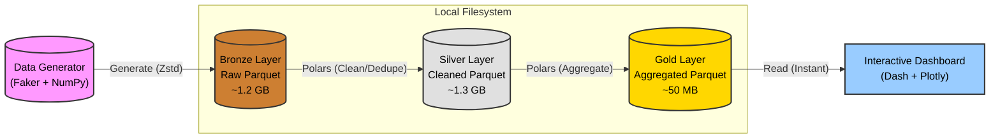

# Lakehouse Architecture Diagram

Here is the visual representation of the Medallion Architecture described in Article 1.

## Mermaid Diagram



## ASCII Version

```
+-----------------+       +------------------+       +------------------+       +----------------+
|                 |       |                  |       |                  |       |                |
|  Data Generator |------>|   Bronze Layer   |------>|   Silver Layer   |------>|   Gold Layer   |
| (Faker + NumPy) | Write |   (Raw Parquet)  | Clean | (Cleaned Parquet)| Agg   | (Aggregations) |
|                 |       |     ~1.2 GB      |       |      ~1.3 GB     |       |     ~50 MB     |
+-----------------+       +------------------+       +------------------+       +-------+--------+
                                                                                        |
                                                                                        | Read
                                                                                        v
                                                                               +----------------+
                                                                               |                |
                                                                               |  Dash App UI   |
                                                                               | (Fast Loading) |
                                                                               |                |
                                                                               +----------------+
```